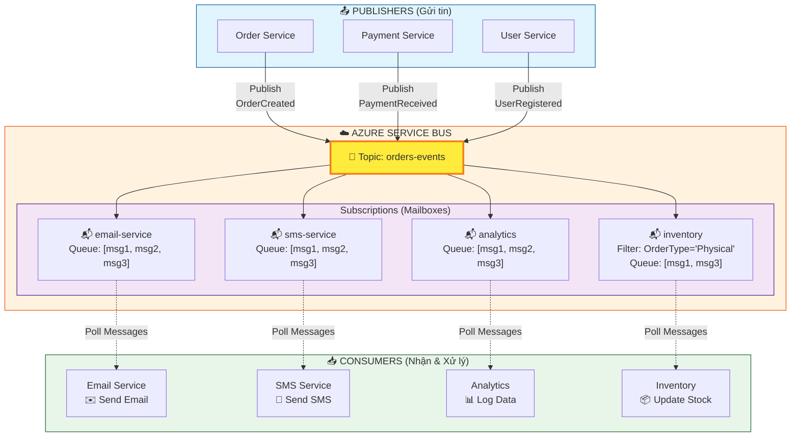
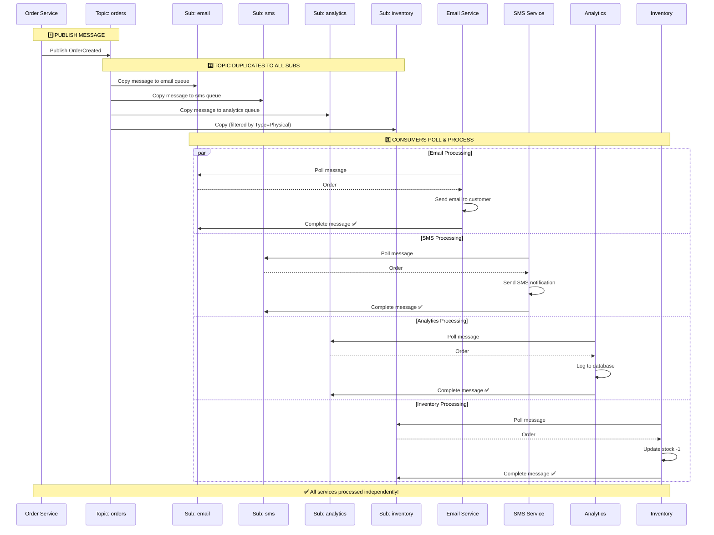
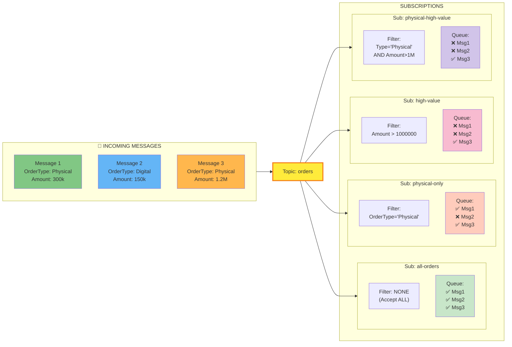
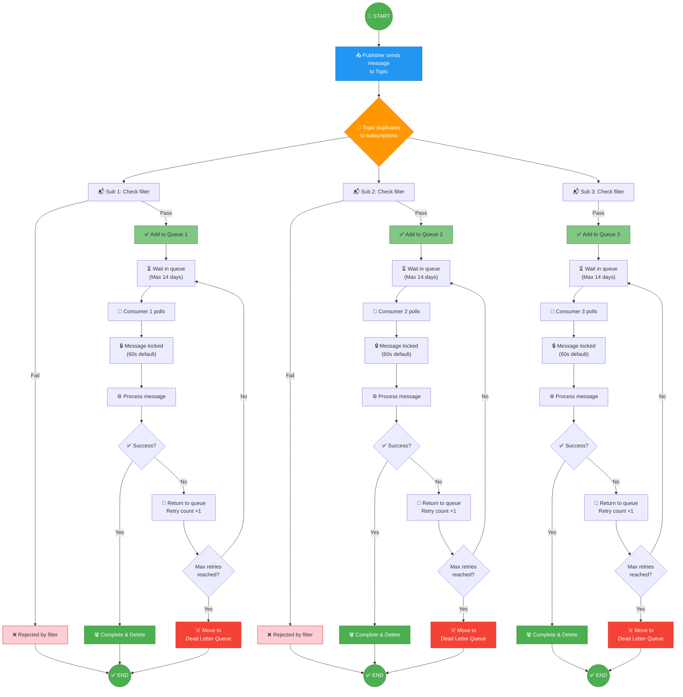
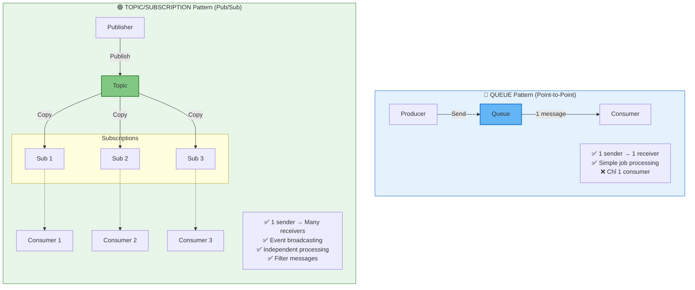

# Azure Service Bus - Topic & Pub/Sub Flow

## Kiến trúc tổng quan

## Message Flow chi tiết

## Subscription với Filter Rules

## Lifecycle của 1 Message

## So sánh Queue vs Topic/Subscription

