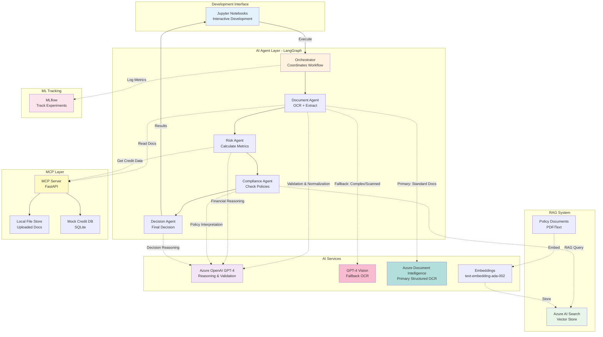
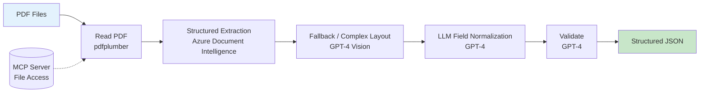
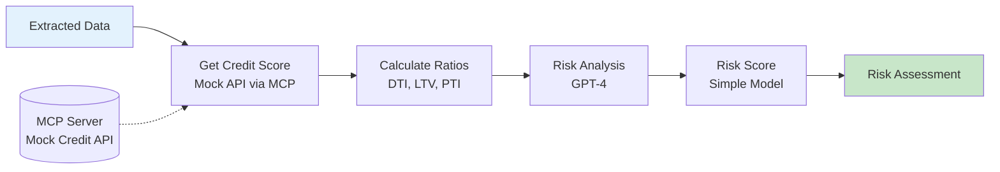
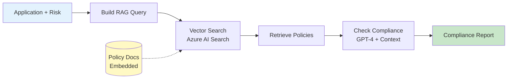
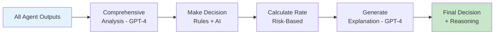
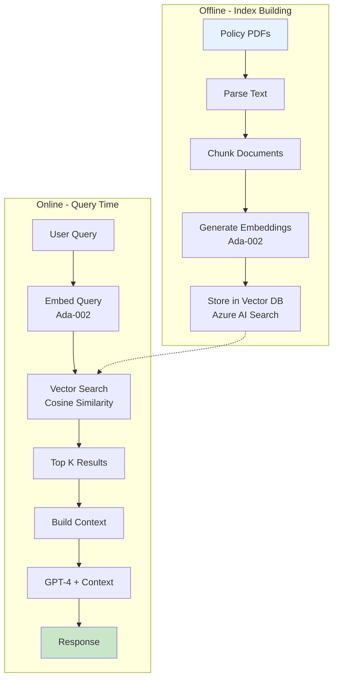
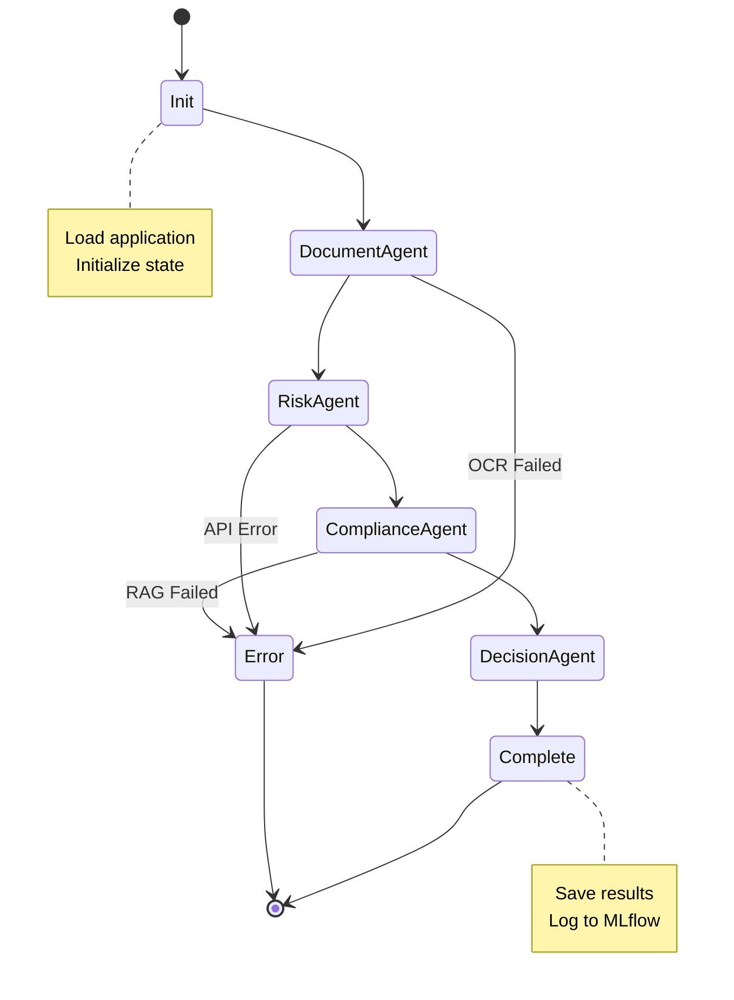

# 🎓 Simplified Loan Underwriting AI Agent - Research Project

**Purpose:** Educational/Research project to understand AI agent workflows, Gen AI reasoning, OCR, RAG, and MCP integration.

**Date:** November 19, 2025  
**Focus:** Core concepts, not production-ready system

---

## Table of Contents

1. [Project Goals](#project-goals)
2. [Simplified Architecture](#simplified-architecture)
3. [Technology Stack](#technology-stack)
4. [Core Components](#core-components)
5. [Learning Objectives](#learning-objectives)
6. [Implementation Phases](#implementation-phases)

---

## 1. Project Goals

### What You'll Learn

✅ **AI Agent Orchestration**
- Multi-agent collaboration using LangGraph
- State management across agents
- Sequential workflow coordination

✅ **Gen AI Reasoning**
- Using GPT-4 for document analysis
- Prompt engineering for structured outputs
- Decision-making with LLMs

✅ **OCR & Document Processing**
- Extract text from PDF files
- GPT-4 Vision for document understanding
- Structured data extraction

✅ **RAG (Retrieval Augmented Generation)**
- Vector embeddings for policy documents
- Semantic search with Azure AI Search
- Context-aware AI responses

✅ **MCP (Model Context Protocol)**
- Unified data access layer
- Connecting AI agents to data sources
- API integration patterns

### What We're NOT Building (Out of Scope)

❌ Disaster Recovery / Multi-region deployment  
❌ Advanced authentication (Azure AD, MFA)  
❌ Production-grade security  
❌ Horizontal scaling / Load balancing  
❌ Complex UI with user management  
❌ Real credit bureau integration  
❌ Compliance reporting systems  

---

## 2. Simplified Architecture



### Architecture Principles

1. **Notebook-First Development** - Interactive Jupyter notebooks for learning and experimentation
2. **Single Machine Deployment** - Everything runs locally or on one VM
3. **Simple Storage** - Local filesystem for documents, SQLite for metadata
4. **Mock External APIs** - Simulate credit bureau, no real integrations
5. **Observable** - Clear logging to understand agent reasoning
6. **Minimal UI** - Optional simple demo interface (not required for learning)

---

## 3. Technology Stack

### Core Technologies

```yaml
AI & ML:
  - Azure OpenAI Service:
      - GPT-4: Multi-step reasoning, decision support, validation
      - GPT-4 Vision: Fallback OCR for complex/scanned documents
      - text-embedding-ada-002: Vector embeddings for RAG
  - Azure Document Intelligence (Form Recognizer): Primary structured OCR (prebuilt models)
  - LangChain: Agent framework, tools, prompt templates
  - LangGraph: Multi-agent orchestration and state management
  - MLflow: Experiment tracking and metrics

RAG System:
  - Azure AI Search: Vector database with hybrid search (Free/Basic tier)
  - pdfplumber: Fast PDF text extraction

MCP (Data Access):
  - FastAPI: Simple HTTP server for unified data access
  - Pydantic: Data validation and schemas
  
Storage:
  - Local Filesystem: Document storage
  - SQLite: Application metadata
  - JSON Files: Configuration and extracted data

Development:
  - Python 3.10+
  - pip / Poetry: Dependency management
  - Jupyter Notebooks: Primary development environment
  - VS Code: IDE
```

### Technology Inventory Table

| Category | Component / Service | Purpose | Notes |
|----------|---------------------|---------|-------|
| **LLM & Reasoning** | Azure OpenAI GPT-4 | Multi-step reasoning, decision support, field validation | Primary intelligence layer |
| **OCR - Primary** | Azure Document Intelligence | Structured extraction from standard documents | Use prebuilt models (pay stubs, IDs, invoices) |
| **OCR - Fallback** | Azure OpenAI GPT-4 Vision | Handle complex layouts, scanned images, edge cases | When Document Intelligence confidence low |
| **Embeddings** | Azure OpenAI text-embedding-ada-002 | Vector representations for semantic search | 1536-dimensional vectors |
| **Orchestration** | LangGraph | Stateful multi-agent workflow | Manages agent sequencing & state |
| **Agent Framework** | LangChain | Tool abstraction, prompts, memory | Wraps LLM calls with utilities |
| **Vector Database** | Azure AI Search | Hybrid semantic + keyword search | Free tier sufficient for prototype |
| **PDF Parsing** | pdfplumber | Fast text layer extraction | Use before structured OCR |
| **Data Access Layer** | FastAPI MCP Server | Unified connectors (files, mock APIs) | Protocol abstraction |
| **Data Models** | Pydantic | Schema validation & serialization | Type safety |
| **File Storage** | Local Filesystem | Uploaded PDFs & JSON outputs | Simple research setup |
| **Metadata Store** | SQLite | Application records & run logs | Zero configuration |
| **Experiment Tracking** | MLflow | Metrics, parameters, artifacts | Local tracking server |
| **Development Environment** | Jupyter Notebooks | Interactive experimentation | Primary interface (replaces UI) |
| **Visualization** | Plotly (in notebooks) | Charts for ratios & timelines | Optional |
| **Language** | Python 3.10+ | Core development | Async support |
| **Dependency Management** | pip / Poetry | Package installation & locking | requirements.txt or pyproject.toml |
| **IDE** | VS Code | Code editor with notebook support | Extensions for Python, Jupyter |
| **Version Control** | Git + GitHub | Source control | Track experiments |

> **Technology Strategy:** The table above centralizes all components. Document Intelligence handles 80-90% of standard documents efficiently, with GPT-4 Vision as a quality fallback for edge cases. Notebooks replace traditional UI for interactive learning.

### Why These Choices?

- **Azure Document Intelligence**: Cost-effective structured extraction for 80-90% of standard documents
- **GPT-4 Vision**: Premium fallback for edge cases and validation when Document Intelligence struggles
- **GPT-4**: State-of-the-art reasoning for risk analysis and decision-making
- **LangGraph**: Best tool for multi-agent workflows with clear state management
- **Azure AI Search**: Free tier supports vector search perfectly for learning
- **Notebooks**: Interactive, immediate feedback, easier debugging than building UI
- **MLflow**: Industry standard for ML tracking
- **SQLite**: Zero setup, perfect for research
- **FastAPI MCP**: Simple, fast, clear protocol abstraction

---

## 4. Core Components

### 4.1 Document Agent (OCR + Extraction)

**Purpose:** Extract structured data from uploaded PDF documents



**Key Learning:**
- Structured extraction vs raw OCR
- When to prefer Azure Document Intelligence vs GPT-4 Vision
- Prompt engineering for gap-filling & normalization
- Multi-pass validation with LLMs

**Example Files Processed:**
- Pay stubs (income verification)
- Bank statements (asset verification)
- Tax returns (income history)
- Driver's license (identity)
- Employment letters (fallback to Vision for unusual formatting)

**Processing Pipeline:**
1. **pdfplumber**: Quick text layer extraction (fast, cheap, provides context)
2. **Azure Document Intelligence**: Primary structured extraction using prebuilt models
   - Pay stub model: Extracts employer, gross/net pay, pay period
   - Invoice model: For bank statements, tax forms
   - ID document model: For driver's license
   - Returns confidence scores per field
3. **GPT-4 Vision (Conditional Fallback)**: Triggered when:
   - Document Intelligence confidence < 0.7 on critical fields
   - Document type not supported by prebuilt models
   - Scanned image with poor quality
   - Handwritten sections requiring interpretation
4. **GPT-4 Text Mode**: Normalizes and validates extracted data
   - Unifies field names across tools
   - Infers derived values (e.g., monthly from annual income)
   - Cross-validates numeric relationships
5. **Validation Pass**: Consistency checks with targeted prompts

**Cost & Performance Optimization:**
- Document Intelligence: ~$0.001 per page (prebuilt models on free tier initially)
- GPT-4 Vision: ~$0.01-0.03 per image (use sparingly for fallback only)
- Strategy: Try Document Intelligence first (10x cheaper), escalate to Vision only when needed

**Selection Logic:**
| Condition | Primary Tool | Fallback Tool | Rationale |
|-----------|--------------|---------------|-----------|
| Clean digital PDF, standard format | Document Intelligence | None needed | Fast, cheap, accurate for 90% cases |
| DI confidence < 0.7 on key field | GPT-4 Vision | Manual review flag | Vision better at ambiguous layouts |
| Image-only / scanned PDF | GPT-4 Vision | Document Intelligence | Vision designed for pure images |
| Unusual document type | GPT-4 Vision | None | Vision has broader understanding |
| Final schema normalization | GPT-4 (text) | None | JSON structure adherence |

**Validation Heuristics (Examples):**
- Net income <= Gross income
- Pay period dates chronological
- Bank balance never negative (unless overdraft flagged)
- Tax year matches document header year

**Fallback Strategy:** 
- If Document Intelligence and Vision produce conflicting values for critical fields (e.g., income amount), prompt GPT-4 with both results and ask it to adjudicate based on document context and business logic.
- Log all fallback cases to understand which document types need custom model training.

---

### 4.2 Risk Agent (Financial Analysis)

**Purpose:** Calculate financial ratios and assess lending risk



**Key Learning:**
- How to use MCP for data retrieval
- LLM reasoning about financial risk
- Combining rules + AI judgment

**Calculations:**
- **DTI** (Debt-to-Income): `(Total Debt / Income) × 100`
- **LTV** (Loan-to-Value): `(Loan Amount / Property Value) × 100`
- **PTI** (Payment-to-Income): `(Monthly Payment / Monthly Income) × 100`

---

### 4.3 Compliance Agent (RAG)

**Purpose:** Check application against lending policies using RAG



**Key Learning:**
- RAG pipeline: Query → Embed → Search → Retrieve → Generate
- Vector similarity search
- How context improves LLM accuracy
- Semantic search vs keyword search

**Sample Policies:**
- Minimum credit score: 640
- Maximum DTI ratio: 43%
- Income verification requirements
- Loan amount limits

---

### 4.4 Decision Agent (Final Decision)

**Purpose:** Make final approve/reject decision with explanation



**Key Learning:**
- Multi-factor decision making with AI
- Transparent AI reasoning
- Combining structured rules with LLM judgment

**Decision Output:**
- **Status**: Approved / Rejected / Conditional / Pending
- **Interest Rate**: Risk-adjusted rate
- **Conditions**: Requirements (if conditional)
- **Explanation**: Clear reasoning in plain language

---

### 4.5 MCP Server (Data Access)

**Purpose:** Unified API for agents to access data sources

```python
# MCP Server Structure with Database Access
from fastapi import FastAPI, HTTPException
import sqlite3
from pathlib import Path

app = FastAPI()

# Connector 1: File Storage
@app.get("/files/{filename}")
def read_file(filename: str):
    """Read uploaded document from filesystem"""
    file_path = Path(f"./data/applications/{filename}")
    if not file_path.exists():
        raise HTTPException(status_code=404, detail="File not found")
    return {
        "filename": filename,
        "content": file_path.read_bytes(),
        "size": file_path.stat().st_size
    }

# Connector 2: Credit Bureau (Mock Database)
@app.get("/credit/{ssn}")
def get_credit_score(ssn: str):
    """Get credit data from mock credit database"""
    conn = sqlite3.connect('./data/mock_credit_bureau.db')
    cursor = conn.cursor()
    
    # Query mock credit database
    cursor.execute("""
        SELECT credit_score, payment_history, credit_utilization, 
               accounts_open, derogatory_marks, credit_age_months
        FROM credit_reports 
        WHERE ssn = ?
    """, (ssn,))
    
    result = cursor.fetchone()
    conn.close()
    
    if not result:
        # Return default/unknown profile if not found
        return {
            "credit_score": None,
            "status": "no_history",
            "message": "No credit history found"
        }
    
    return {
        "credit_score": result[0],
        "payment_history": result[1],  # e.g., "98% on-time"
        "credit_utilization": result[2],  # e.g., 25%
        "accounts_open": result[3],
        "derogatory_marks": result[4],
        "credit_age_months": result[5],
        "retrieved_at": "2025-11-19T00:00:00Z"
    }

# Connector 3: Application Database
@app.get("/application/{app_id}")
def get_application(app_id: str):
    """Get application data from SQLite"""
    conn = sqlite3.connect('./data/database.sqlite')
    cursor = conn.cursor()
    
    cursor.execute("""
        SELECT app_id, applicant_name, loan_amount, property_value,
               annual_income, created_at, status
        FROM applications 
        WHERE app_id = ?
    """, (app_id,))
    
    result = cursor.fetchone()
    conn.close()
    
    if not result:
        raise HTTPException(status_code=404, detail="Application not found")
    
    return {
        "app_id": result[0],
        "applicant_name": result[1],
        "loan_amount": result[2],
        "property_value": result[3],
        "annual_income": result[4],
        "created_at": result[5],
        "status": result[6]
    }

# Helper: Seed mock credit database (run once on setup)
@app.post("/admin/seed_credit_db")
def seed_credit_database():
    """Populate mock credit database with test data"""
    conn = sqlite3.connect('./data/mock_credit_bureau.db')
    cursor = conn.cursor()
    
    cursor.execute("""
        CREATE TABLE IF NOT EXISTS credit_reports (
            ssn TEXT PRIMARY KEY,
            credit_score INTEGER,
            payment_history TEXT,
            credit_utilization REAL,
            accounts_open INTEGER,
            derogatory_marks INTEGER,
            credit_age_months INTEGER
        )
    """)
    
    # Insert mock profiles
    test_data = [
        ('123-45-6789', 745, '98% on-time', 25.0, 8, 0, 84),
        ('987-65-4321', 680, '92% on-time', 45.0, 5, 1, 48),
        ('555-12-3456', 820, '100% on-time', 15.0, 12, 0, 120),
        ('444-55-6666', 620, '85% on-time', 75.0, 3, 3, 24),
    ]
    
    cursor.executemany("""
        INSERT OR REPLACE INTO credit_reports VALUES (?, ?, ?, ?, ?, ?, ?)
    """, test_data)
    
    conn.commit()
    conn.close()
    
    return {"message": "Credit database seeded successfully", "records": len(test_data)}
```

**Key Learning:**
- MCP protocol abstracts data sources
- Agents don't know if data comes from files, databases, or APIs
- Easy to swap mock database for real credit bureau API later
- Centralized error handling and logging
- Consistent response format across connectors

**Database Schema (Mock Credit Bureau):**
```sql
CREATE TABLE credit_reports (
    ssn TEXT PRIMARY KEY,
    credit_score INTEGER,           -- 300-850
    payment_history TEXT,            -- "98% on-time"
    credit_utilization REAL,         -- Percentage 0-100
    accounts_open INTEGER,           -- Number of active accounts
    derogatory_marks INTEGER,        -- Collections, bankruptcies, etc.
    credit_age_months INTEGER        -- Average age of credit accounts
);
```

**Benefits of Database-Backed MCP:**
- Realistic data retrieval patterns
- Can test with diverse applicant profiles
- Simulates real-world latency
- Easy to add more test cases
- Demonstrates proper data abstraction

---

### 4.6 RAG System (Policy Retrieval)

**RAG Pipeline:**



**Key Learning:**
- How embeddings represent semantic meaning
- Vector similarity search mechanics
- Context augmentation improves LLM responses
- Chunking strategies for better retrieval

---

### 4.7 LangGraph Orchestration

**State Machine:**



**Key Learning:**
- Multi-agent coordination
- State persistence across agents
- Error handling in agent workflows
- Sequential vs parallel execution

---

### 4.8 Development Interface (Notebooks)

**Primary Approach:** Interactive Jupyter notebooks for learning and experimentation

```python
# Notebook-based workflow example
# Each notebook builds on previous phases

# 00_setup_and_test.ipynb - Already created ✓
# Verify Azure connections, test GPT-4, embeddings, vision

# 01_document_agent.ipynb - Already created ✓
# Build document extraction pipeline

# 02_risk_agent.ipynb - Next phase
# Calculate financial metrics, assess risk

# Example cell in risk agent notebook:
from src.agents.risk_agent import RiskAgent
from data.extracted.application_TEST-001 import extracted_data

agent = RiskAgent()
risk_assessment = agent.analyze(extracted_data)

# Display results interactively
import plotly.graph_objects as go
fig = go.Figure(data=[
    go.Bar(name='Metrics', x=['DTI', 'LTV', 'PTI'], 
           y=[risk_assessment.dti, risk_assessment.ltv, risk_assessment.pti])
])
fig.show()

print(f"Risk Level: {risk_assessment.risk_level}")
print(f"Reasoning:\n{risk_assessment.reasoning}")
```

**Notebook Benefits for Learning:**
- Immediate visual feedback on each step
- Easy to experiment with different prompts
- See intermediate outputs from each agent
- Compare results across test cases side-by-side
- Natural documentation of learning process
- Can rerun cells to test variations

**Optional Simple Demo UI (Future):**
If you want a minimal interface for demonstrations:
- Single-page Streamlit app (~50 lines)
- Upload PDF + view results
- Focus on visualization, not forms
- Built after core agents work in notebooks

---

## 5. Learning Objectives

### Phase 1: Document Processing & OCR

**What You'll Understand:**
- How GPT-4 Vision reads PDF documents
- Extracting structured data from unstructured text
- Prompt engineering for reliable extraction
- Handling OCR errors and validation

**Hands-on Exercise:**
```python
# Extract income from pay stub using GPT-4
prompt = """
Extract the following from this pay stub:
- Employee name
- Gross income
- Net income
- Pay period

Document text: {ocr_text}

Output as JSON.
"""

response = openai.ChatCompletion.create(
    model="gpt-4",
    messages=[{"role": "user", "content": prompt}]
)
```

---

### Phase 2: Gen AI Reasoning

**What You'll Understand:**
- How LLMs perform multi-step reasoning
- Structured output generation
- Combining domain knowledge with AI judgment
- Confidence scoring and uncertainty handling

**Hands-on Exercise:**
```python
# Risk analysis with GPT-4
prompt = """
Analyze the lending risk for this applicant:

Credit Score: 745
DTI Ratio: 38.5%
LTV Ratio: 75%
Income: $85,000/year
Debt: $2,750/month

Provide:
1. Risk level (low/medium/high)
2. Top 3 risk factors
3. Top 3 mitigating factors
4. Recommendation

Think step-by-step.
"""
```

**Observe:**
- How GPT-4 breaks down the problem
- What factors it considers
- How it balances pros/cons
- Consistency across similar inputs

---

### Phase 3: RAG System

**What You'll Understand:**
- Vector embeddings encode semantic meaning
- Similarity search finds relevant documents
- Context improves LLM accuracy
- Chunking and retrieval strategies

**Hands-on Exercise:**

1. **Index policies:**
```python
# Chunk policy document
chunks = chunk_document(policy_text, chunk_size=500)

# Generate embeddings
embeddings = [
    get_embedding(chunk) 
    for chunk in chunks
]

# Store in vector DB
azure_search.add_documents(chunks, embeddings)
```

2. **Query at runtime:**
```python
# User query
query = "What is the maximum DTI ratio allowed?"

# Embed query
query_embedding = get_embedding(query)

# Search
results = azure_search.search(
    query_embedding, 
    top_k=3
)

# Use context with LLM
context = "\n\n".join([r.text for r in results])
prompt = f"Context:\n{context}\n\nQuestion: {query}"
answer = gpt4(prompt)
```

**Compare:**
- Answer **with** RAG context vs **without**
- Accuracy and specificity differences
- How retrieval affects response quality

---

### Phase 4: MCP Integration

**What You'll Understand:**
- Protocol abstraction benefits
- Unified data access pattern
- Separating data sources from business logic
- API design for AI agents

**Hands-on Exercise:**

1. **Create MCP connector with database:**
```python
class CreditMCPConnector:
    def __init__(self, db_path: str):
        self.db_path = db_path
    
    def get_credit_score(self, ssn: str) -> dict:
        """Query mock credit database"""
        conn = sqlite3.connect(self.db_path)
        cursor = conn.cursor()
        cursor.execute(
            "SELECT credit_score, payment_history FROM credit_reports WHERE ssn = ?",
            (ssn,)
        )
        result = cursor.fetchone()
        conn.close()
        
        if not result:
            return {"score": None, "status": "no_history"}
        
        return {
            "score": result[0],
            "payment_history": result[1]
        }

class FileMCPConnector:
    def read_document(self, path: str) -> bytes:
        """Read document from filesystem"""
        return open(path, 'rb').read()
    
    def list_documents(self, app_id: str) -> List[str]:
        """List all docs for application"""
        return glob.glob(f"./data/{app_id}/*.pdf")
```

2. **Use in agent:**
```python
# Agent calls MCP - doesn't know about underlying database
def risk_agent(ssn: str, extracted_data: dict):
    # Call MCP server
    credit_data = mcp_client.get("/credit/{ssn}")
    
    # Calculate metrics
    dti = calculate_dti(extracted_data)
    
    # Combine with credit data
    risk_profile = {
        "credit_score": credit_data["credit_score"],
        "dti_ratio": dti,
        # ... more analysis
    }
    
    return risk_profile
```

**Benefits:**
- Agent code stays clean and focused on logic
- Easy to swap mock database for real credit bureau API
- Centralized error handling and retry logic
- Clear separation of concerns (business logic vs data access)
- Can add caching, rate limiting at MCP layer
- Database allows realistic testing with diverse profiles

---

### Phase 5: Multi-Agent Orchestration

**What You'll Understand:**
- How LangGraph manages state
- Sequential agent execution
- State passing between agents
- Error handling and recovery

**Hands-on Exercise:**

```python
from langgraph.graph import StateGraph

# Define state
class ApplicationState(TypedDict):
    application_id: str
    documents: List[str]
    extracted_data: dict
    risk_assessment: dict
    compliance_result: dict
    final_decision: dict
    errors: List[str]

# Build graph
workflow = StateGraph(ApplicationState)

# Add agents
workflow.add_node("document_agent", document_agent)
workflow.add_node("risk_agent", risk_agent)
workflow.add_node("compliance_agent", compliance_agent)
workflow.add_node("decision_agent", decision_agent)

# Define edges (sequence)
workflow.add_edge("document_agent", "risk_agent")
workflow.add_edge("risk_agent", "compliance_agent")
workflow.add_edge("compliance_agent", "decision_agent")

# Compile and run
app = workflow.compile()
result = app.invoke(initial_state)
```

**Observe:**
- State updates after each agent
- Data flow between agents
- Error propagation
- Execution time per agent

---

## 6. Implementation Phases

### Phase 1: Basic Setup (Week 1) ✅ COMPLETED

**Goals:**
- Set up Azure OpenAI and Document Intelligence
- Test API connections
- Verify GPT-4, embeddings, and vision

**Deliverables:**
- [x] Azure OpenAI account with GPT-4 access
- [x] Notebook: `00_setup_and_test.ipynb` with connection tests
- [x] Environment configuration template

---

### Phase 2: Document Agent + OCR (Week 2) ✅ COMPLETED

**Goals:**
- Implement PDF reading pipeline
- Test Document Intelligence extraction
- Add GPT-4 Vision fallback
- Structure data with Pydantic models

**Deliverables:**
- [x] Notebook: `01_document_agent.ipynb`
- [x] Pydantic models for extracted data
- [x] Classification logic
- [x] Completeness scoring
- [x] Test with sample documents

---

### Phase 3: Risk Agent + MCP (Week 3) 🔄 IN PROGRESS

**Goals:**
- Build MCP server (FastAPI)
- Implement financial calculations
- Mock credit data retrieval
- Risk analysis with GPT-4

**Deliverables:**
- [ ] Notebook: `02_risk_agent.ipynb`
- [ ] FastAPI MCP server with database queries
- [ ] Mock credit database seeded with test profiles
- [ ] DTI/LTV/PTI calculation functions
- [ ] Risk reasoning with GPT-4

**Test Cases:**
- SSN: 123-45-6789 (credit score 745)
- Income $85k, Debt $2.7k/mo, Loan $450k, Property $600k
- Expected: DTI 38%, LTV 75%, Credit 745, Risk "Medium"

---

### Phase 4: RAG + Compliance Agent (Week 4)

**Goals:**
- Set up Azure AI Search (free tier)
- Index policy documents
- Implement RAG retrieval
- Compliance checking with context

**Deliverables:**
- [ ] Notebook: `03_rag_system.ipynb`
- [ ] Azure AI Search index created
- [ ] 5-10 policy documents indexed
- [ ] Vector search working
- [ ] Notebook: `04_compliance_agent.ipynb`
- [ ] Compliance check with RAG context

**Test Case:**
- Query: "Is DTI 38% acceptable?"
- Expected: Retrieve policy "max 43%" → "Yes, compliant"

---

### Phase 5: Decision Agent (Week 5)

**Goals:**
- Aggregate outputs from all agents
- Implement decision logic
- Generate explanations
- Calculate risk-based rates

**Deliverables:**
- [ ] Notebook: `05_decision_agent.ipynb`
- [ ] Decision rules + AI reasoning
- [ ] Rate calculation logic
- [ ] Explanation generation
- [ ] Visualization of decision factors

**Test Case:**
- Input: Complete application with all agent outputs
- Expected: "Approved at 7.1%" + reasoning

---

### Phase 6: LangGraph Orchestration (Week 6)

**Goals:**
- Connect all agents in workflow
- Implement state management
- Add error handling
- End-to-end pipeline

**Deliverables:**
- [ ] Notebook: `06_orchestration.ipynb`
- [ ] LangGraph workflow definition
- [ ] State transitions between agents
- [ ] Error handling paths
- [ ] Full pipeline test

**Test Case:**
- Submit complete application
- Observe each agent execution
- Verify state persistence
- Review final output

---

### Phase 7: MLflow + Comparison (Week 7)

**Goals:**
- Set up MLflow tracking
- Log agent metrics
- Compare multiple applications
- Track prompt experiments

**Deliverables:**
- [ ] Notebook: `07_end_to_end_demo.ipynb`
- [ ] MLflow local server
- [ ] Metrics logging (time, tokens, costs)
- [ ] Multi-application comparison
- [ ] Experiment tracking dashboard

**Test Case:**
- Process 10+ diverse applications
- View metrics: approval rate, avg time per agent
- Compare different prompt versions

---

### Phase 8: Refinement + Documentation (Week 8)

**Goals:**
- Test edge cases
- Optimize prompts
- Document learnings
- Optional: Build simple demo UI

**Deliverables:**
- [ ] 20+ test applications processed
- [ ] Prompt optimization notes
- [ ] Updated README with full instructions
- [ ] Learning summary document
- [ ] Optional: Simple Streamlit demo (if desired)

---

## Project Structure

```
under-writing-loan/
├── README.md                   # Setup instructions
├── requirements.txt            # Python dependencies
├── .env.example               # Environment variables template
│
├── data/                      # Data storage
│   ├── applications/          # Uploaded documents
│   ├── extracted/             # Extracted JSON outputs
│   ├── policies/              # Policy documents for RAG
│   ├── database.sqlite        # Application metadata
│   └── mock_credit_bureau.db  # Mock credit data (SQLite)
│
├── src/
│   ├── agents/                # AI Agents
│   │   ├── document_agent.py
│   │   ├── risk_agent.py
│   │   ├── compliance_agent.py
│   │   └── decision_agent.py
│   │
│   ├── mcp/                   # MCP Server
│   │   ├── server.py          # FastAPI server
│   │   ├── seed_data.py       # Populate mock credit database
│   │   └── connectors/
│   │       ├── file_connector.py
│   │       └── credit_connector.py
│   │
│   ├── rag/                   # RAG System
│   │   ├── indexer.py         # Index policy docs
│   │   └── retriever.py       # Query vector DB
│   │
│   ├── orchestrator.py        # LangGraph workflow
│   ├── models.py              # Pydantic models
│   └── utils.py               # Helper functions
│
├── notebooks/                 # Jupyter experiments (PRIMARY INTERFACE)
│   ├── 00_setup_and_test.ipynb         # ✅ Created
│   ├── 01_document_agent.ipynb         # ✅ Created
│   ├── 02_risk_agent.ipynb             # 🔄 Next
│   ├── 03_rag_system.ipynb
│   ├── 04_compliance_agent.ipynb
│   ├── 05_decision_agent.ipynb
│   ├── 06_orchestration.ipynb
│   ├── 07_end_to_end_demo.ipynb
│   └── agent_with_azure_openai.ipynb   # ✅ Created (experimental)
│
├── ui/                        # Optional simple demo (future)
│   └── simple_demo.py         # Minimal Streamlit (optional)
│
├── tests/                     # Test data
│   └── sample_applications/
│
└── docs/                      # Documentation
    ├── SIMPLIFIED_ARCHITECTURE.md  # This file
    ├── SETUP_GUIDE.md
    └── LEARNING_NOTES.md
```

---

## Quick Start

### Prerequisites

```bash
# Python 3.10+
python --version

# Azure OpenAI API key
export AZURE_OPENAI_API_KEY="your-key"
export AZURE_OPENAI_ENDPOINT="https://your-resource.openai.azure.com/"
```

### Installation

```bash
# Navigate to project
cd under-writing-loan

# Install dependencies
pip install -r requirements.txt

# Set up environment
cp .env.example .env
# Edit .env with your Azure credentials:
# - AZURE_OPENAI_API_KEY
# - AZURE_OPENAI_ENDPOINT
# - AZURE_DOCUMENT_INTELLIGENCE_ENDPOINT (if using)
# - AZURE_DOCUMENT_INTELLIGENCE_KEY (if using)
```

### Run Notebooks

```bash
# Start Jupyter
jupyter notebook

# Open notebooks in order:
# 1. notebooks/00_setup_and_test.ipynb - Verify setup
# 2. notebooks/01_document_agent.ipynb - Test document extraction
# 3. notebooks/02_risk_agent.ipynb - Next phase
```

### Optional: Start MCP Server

```bash
# First time: Seed mock credit database
python src/mcp/seed_data.py

# Start MCP server in separate terminal
python src/mcp/server.py

# Server runs on http://localhost:8000
# API docs at http://localhost:8000/docs
# Test credit lookup: http://localhost:8000/credit/123-45-6789
```

### Optional: Simple Demo UI (Future)

```bash
# After agents work in notebooks
streamlit run ui/simple_demo.py
```

---

## Expected Outcomes

By the end of this project, you will:

✅ Understand how multi-agent AI systems work  
✅ Know how to orchestrate agents with LangGraph  
✅ Master prompt engineering for structured outputs  
✅ Understand RAG pipeline end-to-end  
✅ Know when to use Document Intelligence vs GPT-4 Vision  
✅ Understand cost/performance tradeoffs in OCR  
✅ Understand MCP protocol benefits  
✅ Be able to build transparent AI decision systems  
✅ Track and evaluate AI system performance with MLflow  
✅ Develop iteratively using notebooks  

---

## Limitations & Simplifications

**This is a research project for learning, NOT production-ready:**

- Notebook-first development (no polished UI required)
- No real authentication or authorization
- Mock credit data (not real bureau APIs)
- Single-user, single-machine deployment
- No data encryption or privacy controls
- Simplified business logic
- No disaster recovery or backups
- Limited error handling
- No horizontal scaling

**Focus is on learning core AI concepts through hands-on experimentation.**

---

## Next Steps

1. **Review this architecture** - Understand components
2. **Set up Azure OpenAI** - Get API access
3. **Start Phase 1** - Basic setup and testing
4. **Iterate through phases** - Build incrementally
5. **Document learnings** - Keep notes on discoveries
6. **Experiment** - Try different prompts, models, approaches
7. **Share findings** - Present results

---

## Resources

### Documentation
- [LangChain Docs](https://python.langchain.com/)
- [LangGraph Tutorial](https://langchain-ai.github.io/langgraph/)
- [Azure OpenAI Docs](https://learn.microsoft.com/en-us/azure/ai-services/openai/)
- [Azure Document Intelligence](https://learn.microsoft.com/en-us/azure/ai-services/document-intelligence/)
- [Azure AI Search](https://learn.microsoft.com/en-us/azure/search/)
- [MLflow Docs](https://mlflow.org/docs/latest/index.html)
- [Jupyter Notebook Best Practices](https://jupyter-notebook.readthedocs.io/)

### Learning Materials
- LangChain YouTube tutorials
- RAG from scratch guides
- Multi-agent system patterns
- Prompt engineering best practices

---

**Let's build and learn! 🚀**
